# Train API Project

### Sence of app creation
This app was created for coworking with train services:
 - Train creation(`Train type`, `Crew`)
 - User creation
 - Ticket creation
And `Journey`, `Route` , `Country` and etc, which connected with train station services

**The main aim of creation this app was to help web services to connect API data to website**

## App description
At the start you meet a such screen

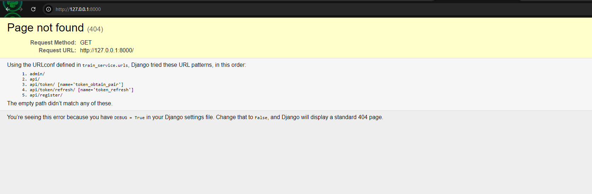
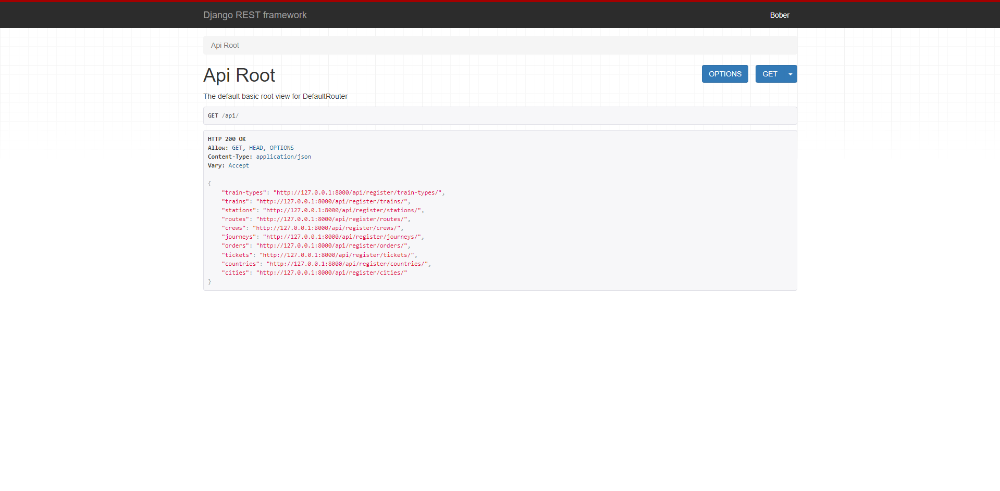
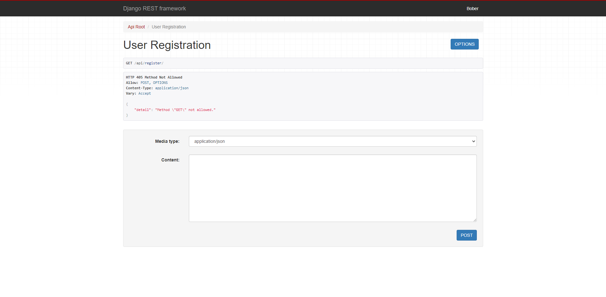
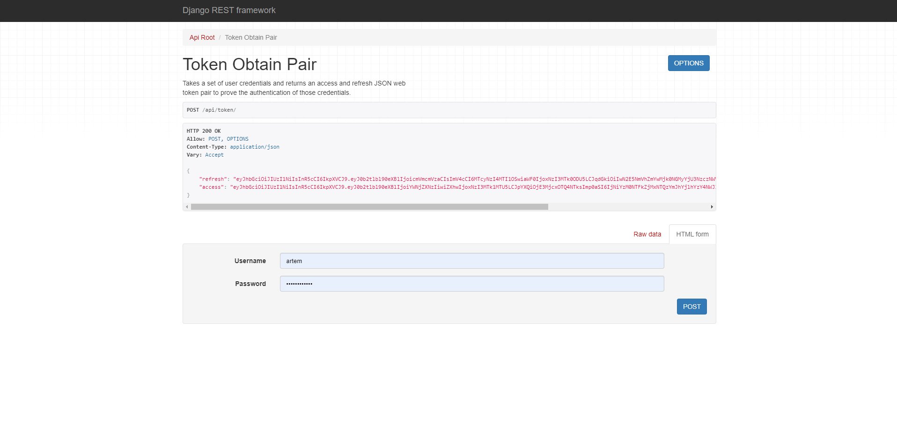
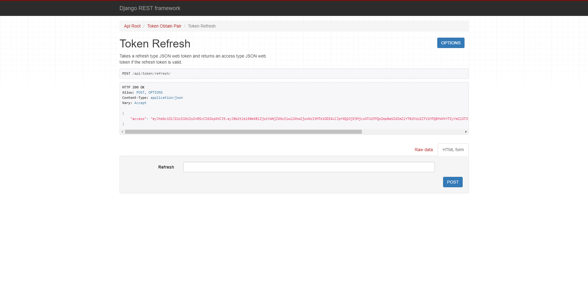
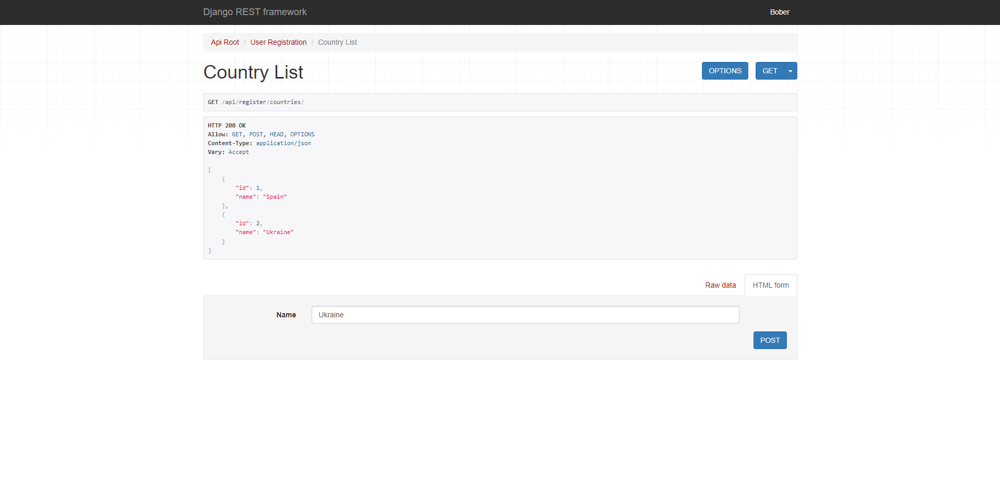
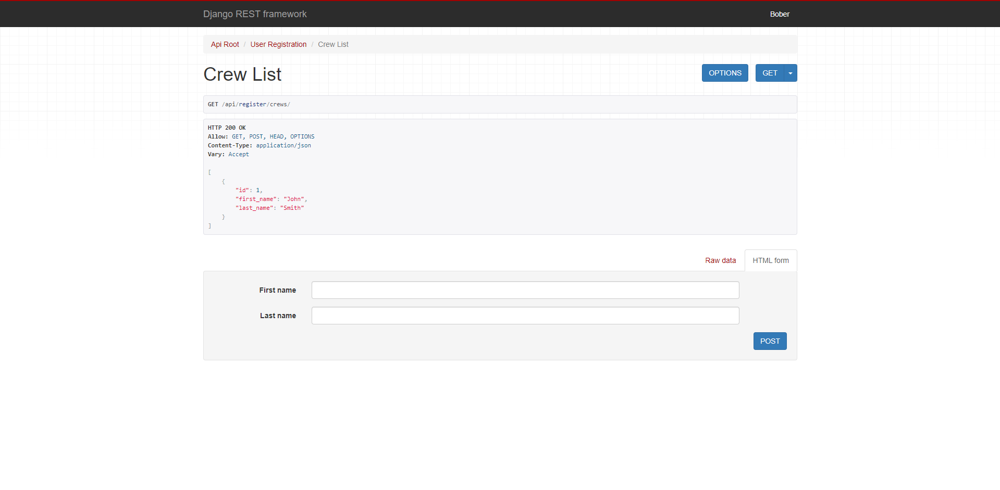
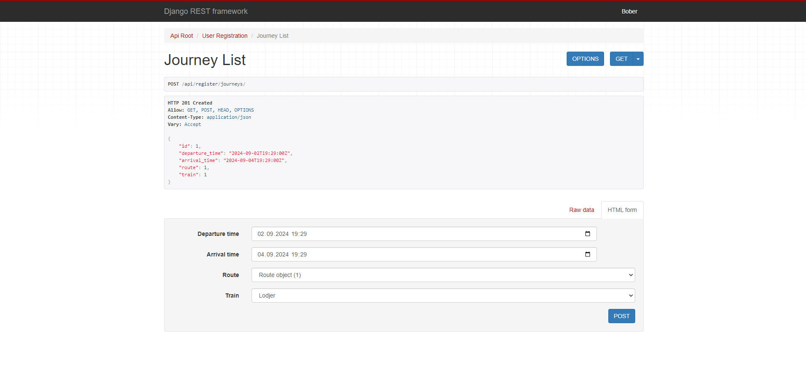

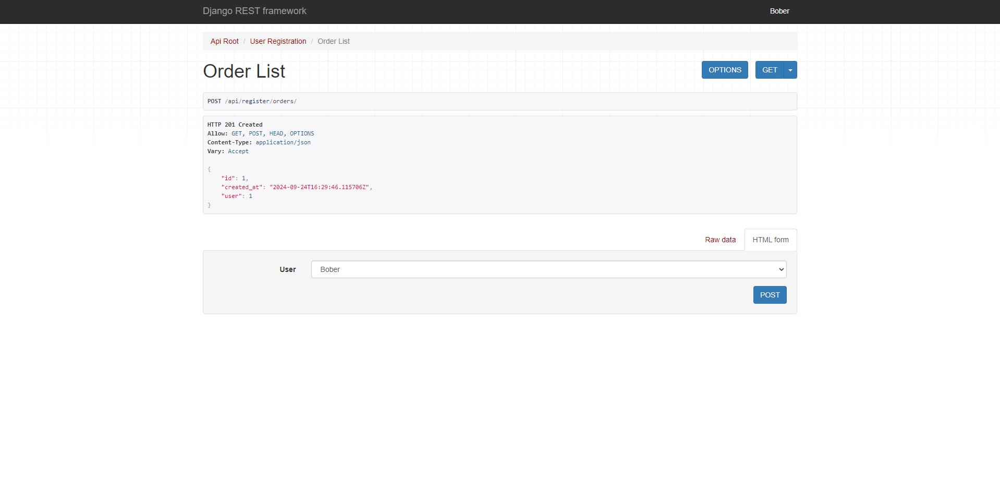
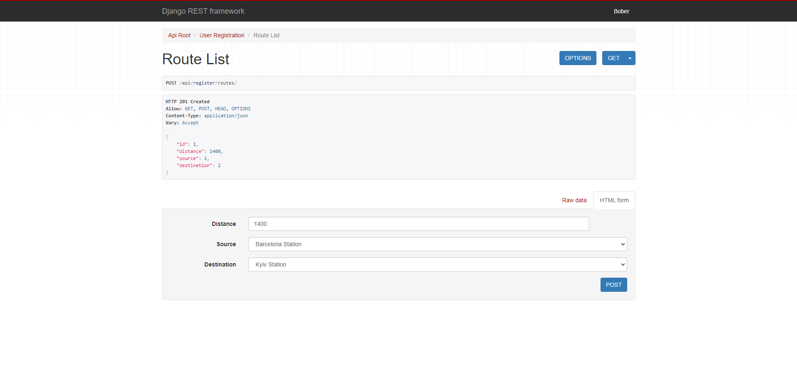
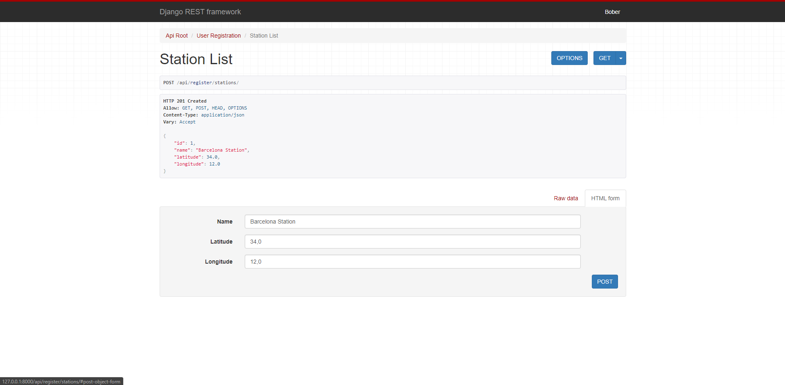
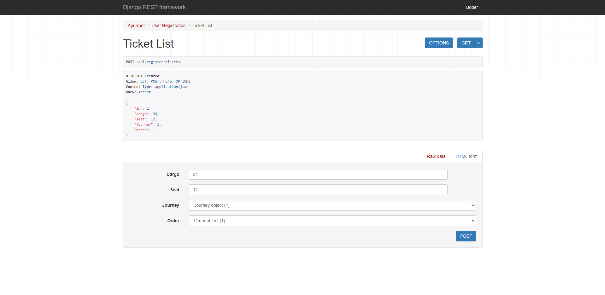
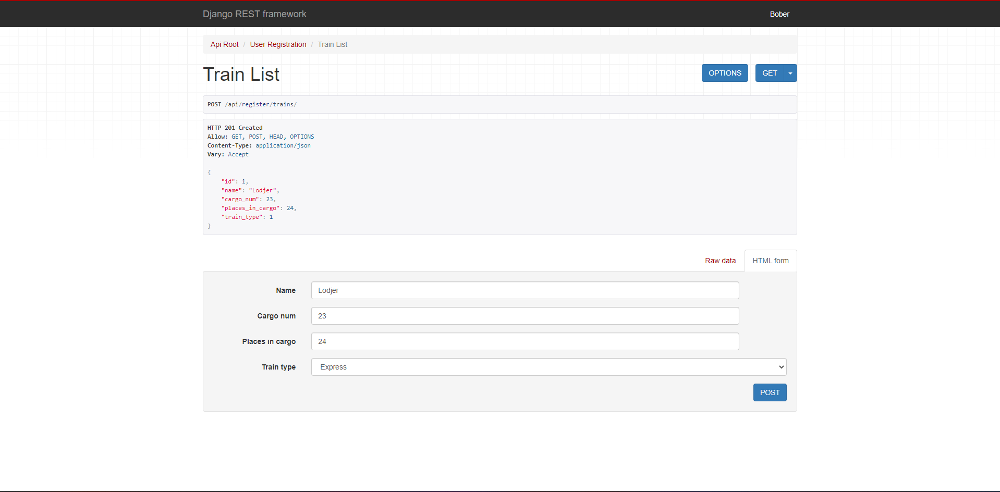
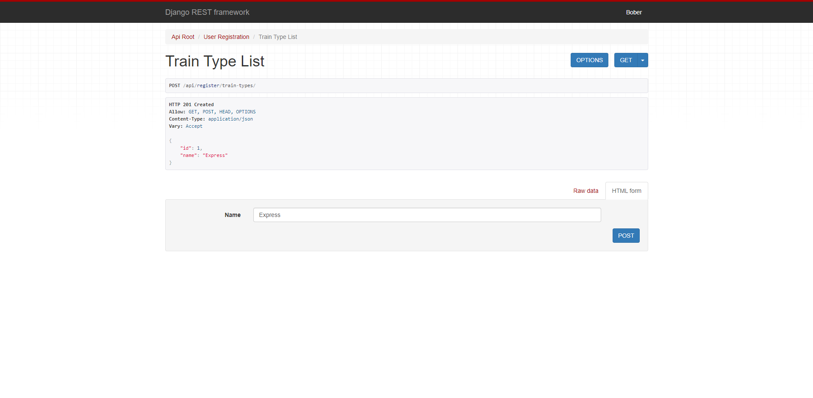
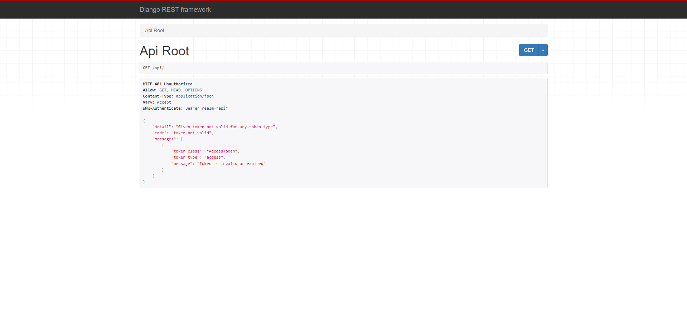