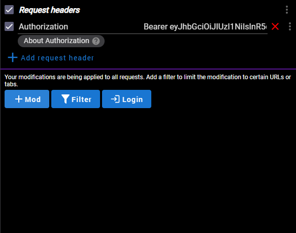

# Train API Project

### Sence of app creation
This app was created for coworking with train services:
 - Train creation(`Train type`, `Crew`)
 - User creation
 - Ticket creation
And `Journey`, `Route` , `Country` and etc, which connected with train station services

**The main aim of creation this app was to help web services to connect API data to website**

## App description
## Start screen
At the start you meet a such screen

## Main page
Here you see main page of all links, but before you see that you need to registrate and then login for getting API token

## User registration
You need to paste data in `context` window in such format:

{

"username": "Your Name",

"password": "your_password",

"email": your email

}

In `email` field don`t use quotes

## Token obtain
When you passed registration you need to fill pointed fields by your `username` and `password` data and copy `access` token

## Mod Headers
You should to download this app in Google.
### Where to find it?
In the top in right corner near `url_link` search field you click in `puzzle icon` and choose `Mod Headers app` and see such window
- Click `Add request header`
- Write `Authorization` in left corner and paste your API key, like `Bearer <API_KEY>`

**You can download MOD HEADERS here:
https://chromewebstore.google.com/detail/modheader-modify-http-hea/idgpnmonknjnojddfkpgkljpfnnfcklj**

## Refresh token
 the refresh token reduce the security risks to a more manageable level, making the overall solution more secure than it would be with just long-lived access tokens. Refresh tokens aren't bad implementations; they're necessary and fix the problem as best as they can.

## Country creation

## Crew creation

## Journey creation

## Order creation

## Route list creation

## Station list creation

## Ticket list creation

## Train list creation

## Train type creation

## Many requests problem
This feature was added to limit number of requests, many requests are able to slow server velocity. So, you need to enter to refresh token page and paste you access token. You get refresh token and use it in Mod Headers, instead of access token
